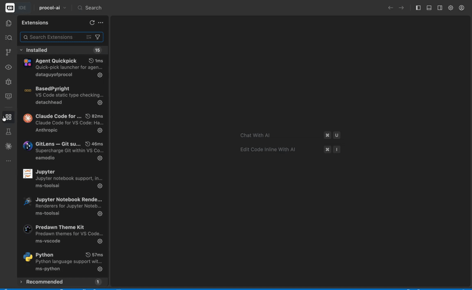

<p align="center">
  
</p>

# Agent Quickpick

> **Zero setup.** Hit `⌘ShiftA` (or `Ctrl+Shift+A`), pick an agent, and get a dedicated terminal tab with its own icon and color theme right in your editor workspace.

Built by a dev for devs who run CLI coding agents in VS Code (or Cursor, Windsurf, Trae, Antigravity, Vodium) and got tired of juggling generic bottom-panel terminals.



---

## Why use it?

- **Zero configuration required**: Works instantly out of the box. It probes your `PATH` automatically and shows you only the agent CLIs you actually have installed.
- **Editor tabs, not bottom panel**: Terminals open as real editor tabs. Split them side-by-side or stacked to run Claude, Aider, and OpenCode simultaneously in the same window.
- **Icons & theme colors out of the box**: Every agent (Claude, Gemini, Codex, Goose, Aider, etc.) gets a distinct icon and tab color so you can identify active sessions at a glance.
- **Frecency sorting**: The agents you launch most float to the top automatically. Order syncs across machines via Settings Sync.
- **Clean & non-intrusive**: Agents not found on your system stay hidden by default so your picker stays clean—click the eye icon in the title bar anytime to reveal them.

---

## Supported agents (out of the box)

No configuration needed—if the tool is on your `PATH`, Agent Quickpick detects it automatically:

| Agent | Command | Agent | Command |
|---|---|---|---|
| Claude | `claude` | Goose | `goose` |
| Codex | `codex` | Crush | `crush` |
| Gemini | `gemini` | Amp | `amp` |
| Copilot | `gh copilot` | Droid | `droid` |
| OpenCode | `opencode` | Qwen | `qwen` |
| Command Code | `cmd` | Plandex | `plandex` |
| Aider | `aider` | Grok | `grok` |
| Cody | `cody` | Kilo | `kilo` |
| Qodo | `qodo` | oh-my-pi | `omp` |
| Terminal | *(plain shell)* | | |

---

## Quick Install

1. Download the latest `.vsix` from [GitHub Actions Artifacts](https://github.com/dataguyofprocol/agent-quickpick/actions).
2. In VS Code, open Extensions (`⌘ShiftX` / `CtrlShiftX`).
3. Click `⋯` (top right) → **Install from VSIX…** and select the file.

*(Submitting to the VS Code Marketplace soon!)*

---

## Optional: Custom agents & tweaks

Most developers never need to touch settings. But if you have custom scripts, package-manager launchers, or want to hide specific built-in agents, configure `agentQuickpick.agents` in `settings.json`:

```jsonc
"agentQuickpick.agents": [
  {
    "name": "Claude GLM",
    "cmd": "claude-glm",
    "icon": "claude-glm.svg",
    "color": "agentQuickpick.claudeGlm"
  },
  {
    "name": "Aider (uvx)",
    "cmd": "aider",
    "launcher": "uvx",       // probes `uvx` on PATH, launches `uvx aider`
    "icon": "aider.svg"
  },
  { "name": "Droid", "hidden": true }
]
```

### Handy settings

- **Using shell aliases / functions**: If your agents rely on shell aliases rather than binaries on `PATH`, turn off detection so they aren't hidden:
  ```jsonc
  "agentQuickpick.detectInstalled": false
  ```
- **Terminal activation scripts leaking into prompt**: If virtualenv/conda activation scripts bleed into an agent's stdin on open, adjust `launchDelayMs` (default 300ms):
  ```jsonc
  "agentQuickpick.launchDelayMs": 500
  ```

---

## License & Notes

- License: [MIT](./LICENSE) *(Icons are stylized original artwork)*
- Maintenance & local setup notes: [MAINTAINERS.md](./MAINTAINERS.md)
- Release history: [CHANGELOG.md](./CHANGELOG.md)
