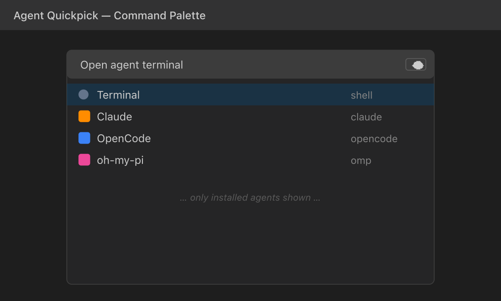
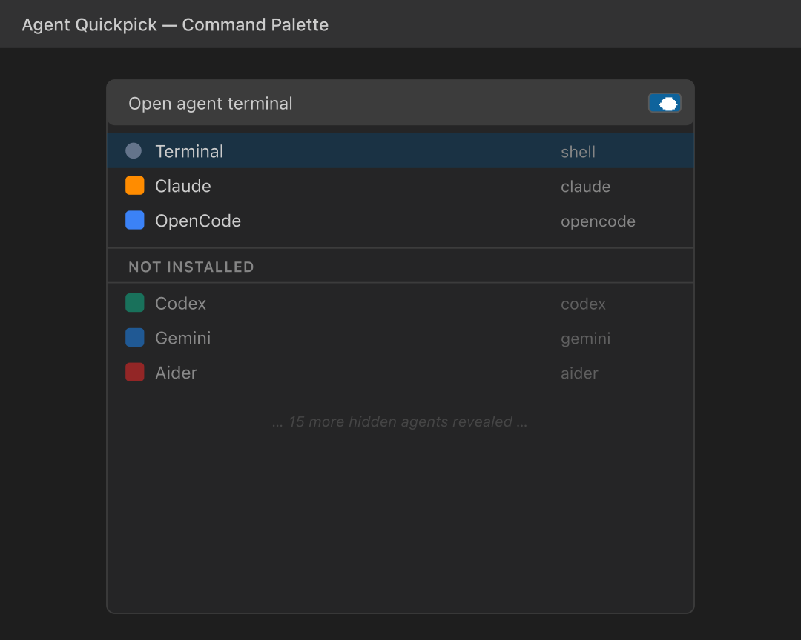
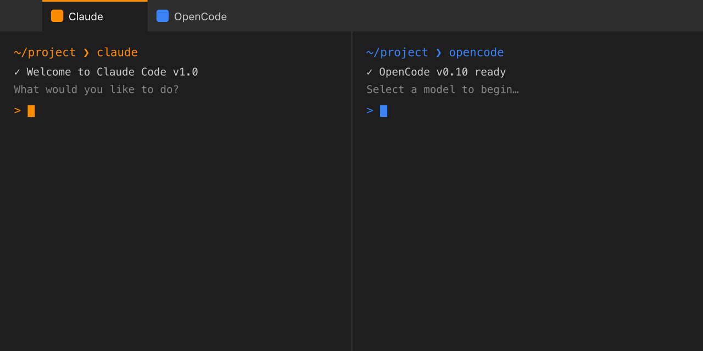

# Agent Quickpick


One quick pick for every terminal coding-agent CLI. Hit **⌘⇧A** / **Ctrl+Shift+A**, pick an agent, get a terminal in the editor area with its own icon and tab color.

Works in VS Code, Cursor, Windsurf, Trae, Antigravity, Vodium — any VS Code fork.

---

<p align="center">
  
</p>

## How it works

- Hit **⌘⇧A** / **Ctrl+Shift+A** and pick an agent from the list.
- It opens in the **editor area** (not the bottom panel), so multiple agents sit side-by-side as editor tabs.
- Each tab gets its **own icon and themed color** so you can tell them apart at a glance.
- Agents whose command isn't on your `PATH` are **hidden by default** — click the **eye** in the title bar to reveal them under a "Not installed" divider.
- Your **most-used agents float to the top** automatically (frecency sorting). It's global, syncs across machines via Settings Sync, and never-launched agents keep the curated order.

<p align="center">
  
</p>

<p align="center">
  
</p>

## Built-in agents

| Agent | Command | Agent | Command |
|---|---|---|---|
| Claude | `claude` | Goose | `goose` |
| Codex | `codex` | Crush | `uvx crush` |
| Gemini | `gemini` | Amp | `amp` |
| Copilot | `gh copilot` | Droid | `droid` |
| OpenCode | `opencode` | Qwen | `qwen` |
| Command Code | `cmd` | Plandex | `plandex` |
| Aider | `aider` | Grok | `grok` |
| Cody | `cody` | Kilo | `kilo` |
| Qodo | `qodo` | oh-my-pi | `omp` |
| Terminal | *(plain shell)* | | |

## Install

**From a `.vsix`** — grab the latest build from [GitHub Actions artifacts](https://github.com/dataguyofprocol/agent-quickpick/actions), then in your editor's **Extensions** panel click **⋯ → Install from VSIX…** and pick the file.

**VS Code Marketplace — coming soon.**

## Customizing

The quick pick works exactly as intended out of the box — most people never need to touch settings. If you do want to add your own agent or hide a built-in one, configure it in `settings.json`:

```jsonc
"agentQuickpick.agents": [
  {
    "name": "Claude GLM",
    "cmd": "claude-glm",
    "icon": "claude-glm.svg",              // bundled filename, absolute path, or codicon id
    "color": "agentQuickpick.claudeGlm"     // built-in id or terminal.ansi*
  },
  {
    "name": "Crush (dev)",
    "cmd": "crush",
    "launcher": "uvx",                      // optional prefix binary; probes `uvx` on PATH, runs `uvx crush`
    "icon": "crush.svg"
  },
  { "name": "Droid", "hidden": true }       // hides a built-in
]
```

| Field | Required | Notes |
|---|---|---|
| `name` | yes | Display name. |
| `cmd` | no | Shell command. Empty = plain terminal. Aliases/functions work (VS Code terminals are interactive). |
| `launcher` | no | Prefix binary (`uvx`, `npx`, `pipx`). When set, detection probes this binary on PATH and the terminal runs `${launcher} ${cmd}`. Useful for package-manager-only agents. |
| `icon` | no | Codicon id (`rocket`, `beaker`, `hubot`), absolute SVG/PNG path, or bundled filename. Missing file → `terminal` codicon fallback. |
| `color` | no | Built-in id (`agentQuickpick.claude`, …) or stock `terminal.ansi*` key. Invalid → no tab color. |
| `hidden` | no | `true` hides a built-in. |

> **Why can't my custom agent get a brand-new color?** VS Code only registers theme colors at publish time, so user-added agents pick from the 8 built-in ids + 16 `terminal.ansi*` keys (24 theme-aware options). Icons have no such limit.

If all your agents rely on shell aliases (`claude-proxy`, etc.), turn detection off so they all show:

```jsonc
"agentQuickpick.detectInstalled": false
```

---

For maintainers, local dev, and architecture notes, see **[MAINTAINERS.md](./MAINTAINERS.md)**.

## Changelog

See [CHANGELOG.md](./CHANGELOG.md).

## License

MIT — see [LICENSE](./LICENSE). Icons are original stylized artwork, not official brand marks.
